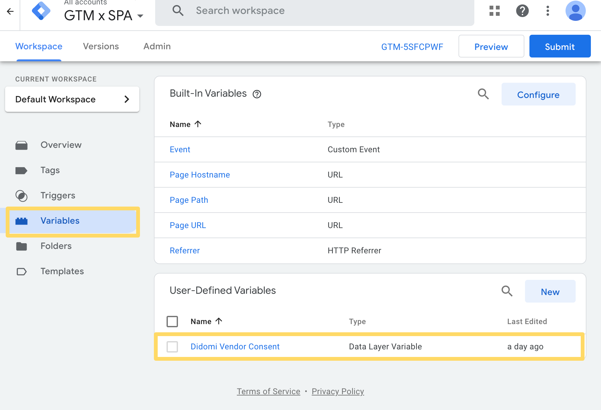
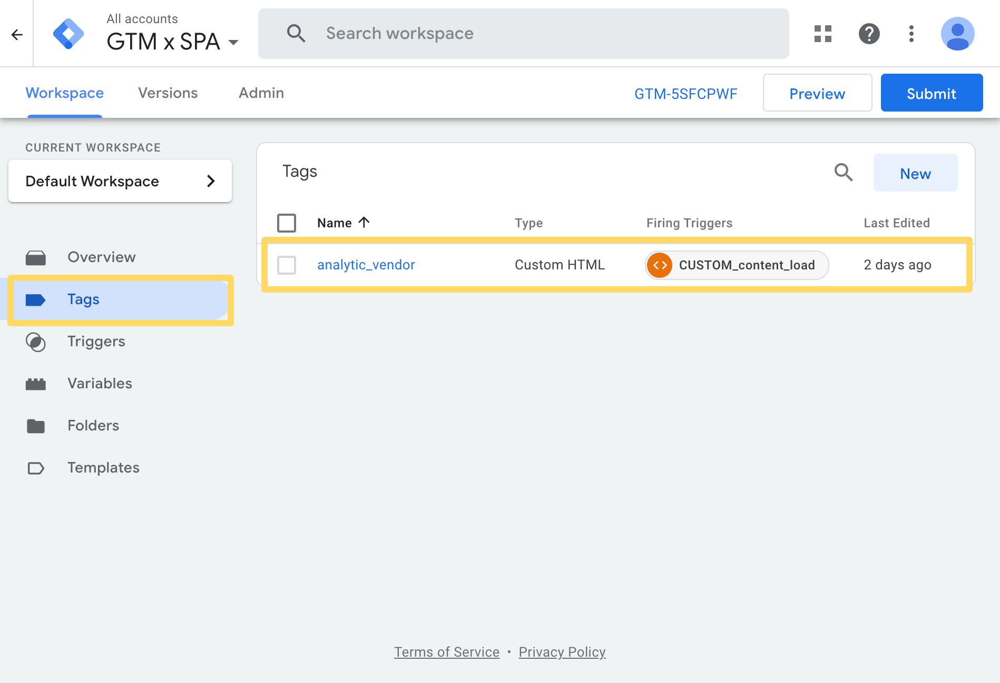
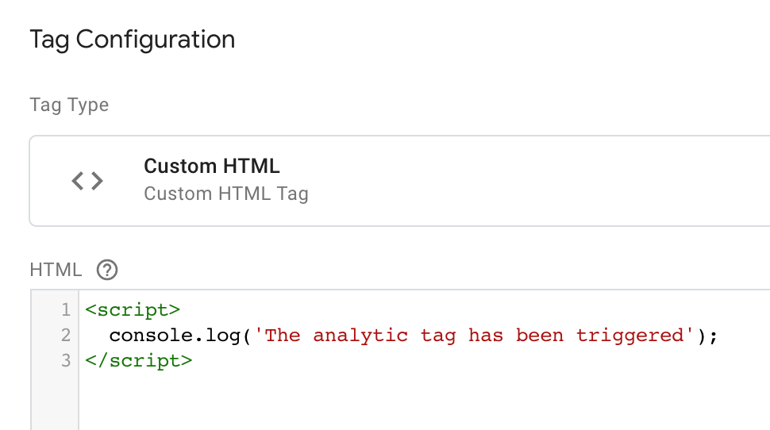
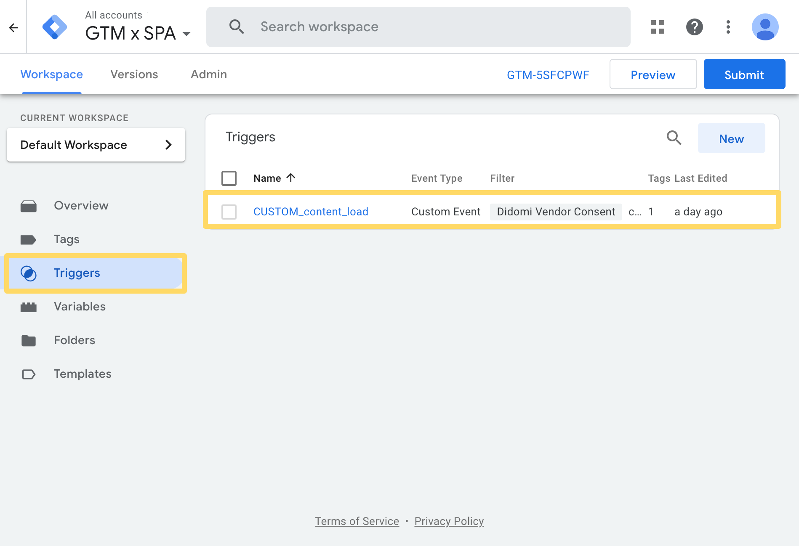
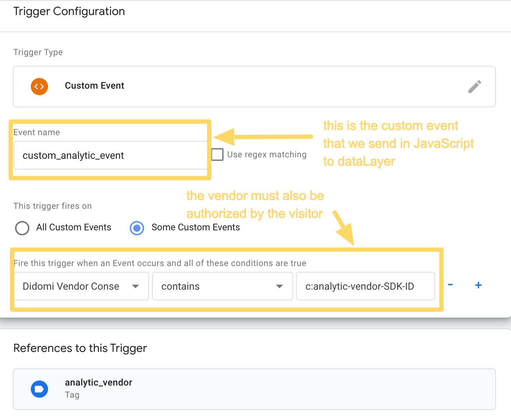

# How to condition tags in GoogleTagManager (GTM) in a Single Page Application (SPA) context

The way to track events in GTM in SPA is different from regular websites because there is no actual page reloading when the visitor navigates through the different sections of the site.

Only certain parts of the content are refreshed, and GTM does not natively records these modifications. A typical usecase is measuring pageviews with an analytics tool. You probably want to trigger analytics each time the visitor navigate to an other "page" of your SPA.

There are many ways to track these changes with Didomi web SDK.  
In the following example, we will describe one solution to do so.


### What we do

We have to write some JavaScript on the front-end side to send a custom event to the dataLayer.
We also have to create a variable and a custom trigger in GTM.

## Front-End: JavaScript

We create the custom event for the dataLayer

#### **`index.html`**
```JavaScript
/*
This function is in charge of sending our custom event (named "custom_analytic_event") in the dataLayer
*/
window.didomiOnReady.push(function (Didomi) {
  window.sendEventToDataLayer = function() {
    dataLayer.push(
      {
        'event': 'custom_analytic_event'
      }
    );
  }
});
```

We connect to the SPA Javascript logic to send this GTM "Custom Trigger" each time we need to activate our analytic tool.

There are **3 triggers**:

### Trigger n°1:  page load

#### **`index.html`**
```javascript
/*
The "loadPage" function refers to the internal JavaScript logic that manages the loading of SPA pages.
It has a callback which is executed right after the content loads.
(It's defined in the "script/singlePageApp.js" file)
The following is executed right after the page is loaded, it charges the 'page1' if the first parameter is undefined.
*/
window.didomiOnReady.push(function (Didomi) {
  loadPage(window.location.hash ? window.location.hash.replace('#', '') : 'page1', function() {
    sendEventToDataLayer()
  })
});
```

### Trigger n°2: page changes

#### **`index.html`**
```JavaScript
/*
Each click on an entry in the top menu triggers the 'sendEventToDataLayer' function.
*/
Array.from(document.querySelectorAll('[data-entry]')).forEach(function(button) {
  button.addEventListener('click', function() {

    var page = this.getAttribute('data-entry');
    loadPage(page, function() {
      sendEventToDataLayer();
    });
  })
});
```

### Trigger n°3: consent status changes

#### **`index.html`**
```JavaScript
/*
Adding a didomiEventListeners to watch the Didomi SDK's 'consent.changed' events allows to send again the custom event in the dataLayer when the user changes his consent status on the cookie notice.
*/
window.didomiEventListeners.push({
  event: 'consent.changed',
  listener: function (context) {
    sendEventToDataLayer();
  }
});
```


## GTM: Variable and Trigger


1. We create the variable.
Didomi's SDK natively send variables to the dataLayer each time the visitor interact with the cookie notice.  
One of these variables is `didomiVendorsConsent` and it contains the list of vendors that have been accepted




2. We create the tag.  
For this example, our "analytic vendor" is just a console.log with the message "the analytic tag has been triggered".






3. We create the trigger.
The trigger needs to check two conditions :
    - the event `custom_analytic_event` has been sent to the dataLayer
    AND
    - the analytic vendor has been accepted on the cookie notice. This information can be verified if the vendor SDK-ID is present in the `didomiVendorsConsent` variable.





And that's it.
