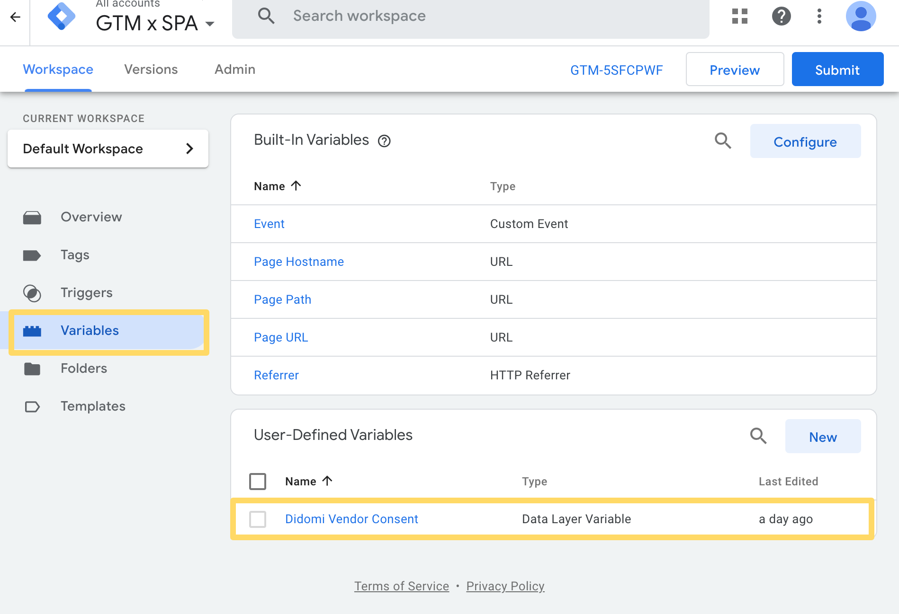
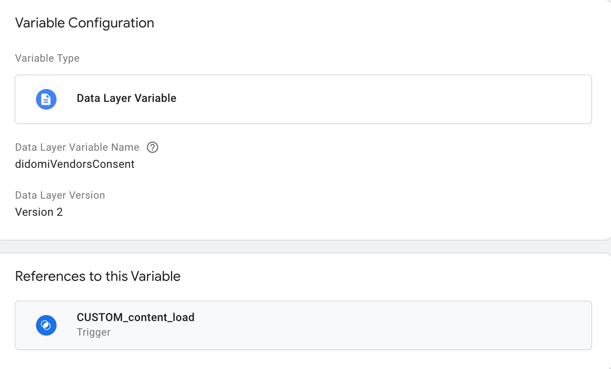
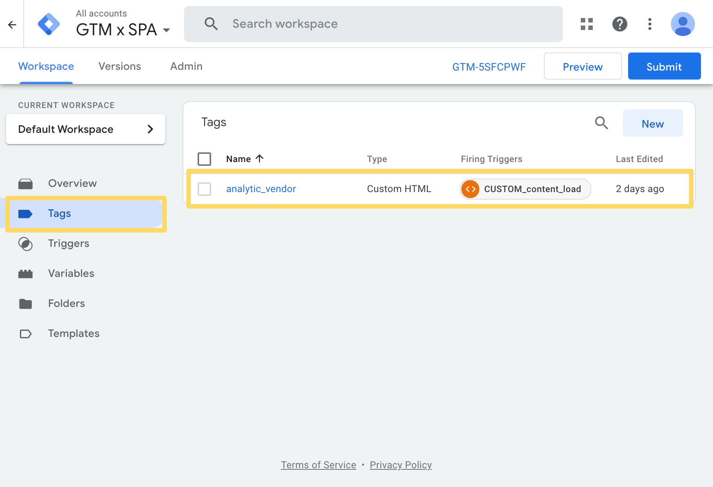
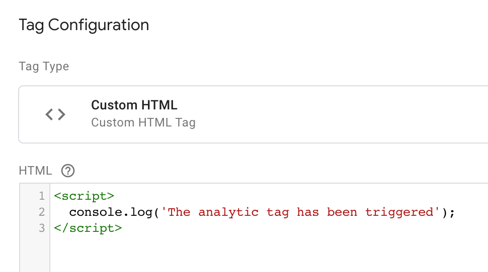
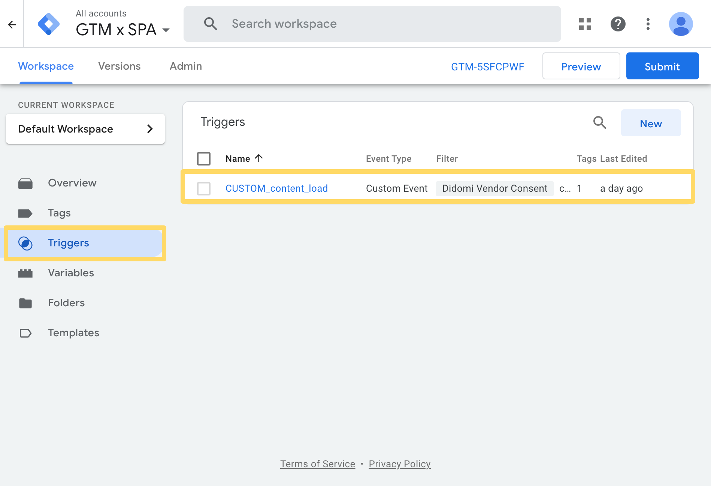
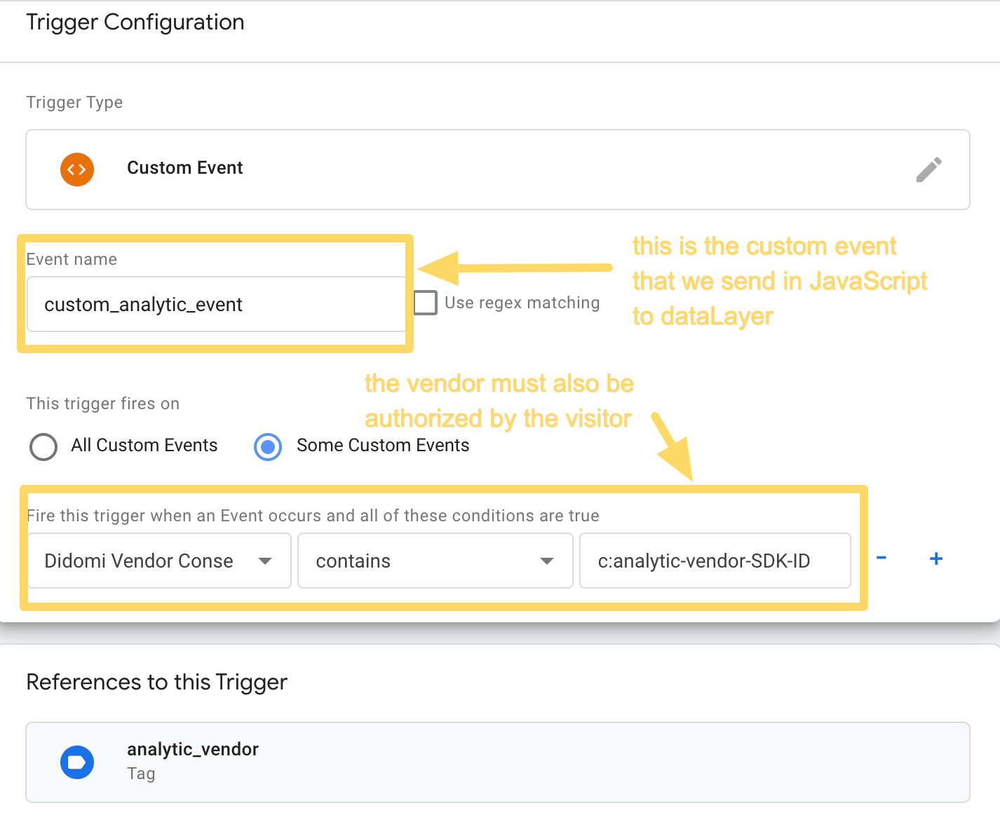

# How to condition tags in GoogleTagManager (GTM) in a Single Page Application (SPA) context

In SPAs, the way of tracking events with GTM differs from the way of tracking on traditional websites because there is no real page reload as the visitor navigates through the different sections of the site.

Only certain parts of the content are refreshed, and natively, GTM does not trigger anything when these changes occur. A typical use case is to measure page views with an analytics tool. In general, we want to trigger this measurement on each "page viewed" of the SPA site.

There are many ways to monitor these types of events.
In the following example, we will describe how to achieve this by configuring *custom triggers* in GTM.

#### Links
Here is a GTM preview of the result : [https://tagassistant.google.com/#/?source=TAG_MANAGER&id=GTM-5SFCPWF&gtm_auth=DxuoYm41p8bX99SSZj3_8A&gtm_preview=env-9&cb=5547747675045429](https://tagassistant.google.com/#/?source=TAG_MANAGER&id=GTM-5SFCPWF&gtm_auth=DxuoYm41p8bX99SSZj3_8A&gtm_preview=env-9&cb=5547747675045429)
And here is the link of the SPA : [https://didomi.github.io/samples/how-to-track-SPA-with-GTM-and-Didomi/](https://didomi.github.io/samples/how-to-track-SPA-with-GTM-and-Didomi/)

### What we do

We plug in a little javascript overlay on the SPA "reloading" event. This overlay will have the function of propagating an event in the GTM dataLayer each time the visitor navigates from one section to another.
We also create the right variables and triggers in GTM


## Front-End: JavaScript

We create the custom event for the dataLayer

#### **`index.html`**
```JavaScript
/*
This function is in charge of sending our custom event (named "custom_analytic_event") in the dataLayer
*/
window.didomiOnReady.push(function (Didomi) {
  window.sendEventToDataLayer = function() {
    dataLayer.push(
      {
        'event': 'custom_analytic_event'
      }
    );
  }
});
```

We connect to the SPA Javascript logic to send this GTM "Custom Trigger" each time we need to activate our analytic tool.

There are **3 triggers** we want to watch out for:

### Trigger n°1:  page load
Obviously, the analytic tool should be triggered when the visitor lands on the site for the first time.

#### **`index.html`**
```javascript
/*
The "loadPage" function refers to the internal JavaScript logic that manages the loading of SPA pages.
It has a callback which is executed right after the content loads.
(It's defined in the "script/singlePageApp.js" file)
The following is executed right after the page is loaded, it charges the 'page1' if the first parameter is undefined.
*/
window.didomiOnReady.push(function (Didomi) {
  loadPage(window.location.hash ? window.location.hash.replace('#', '') : 'page1', function() {
    sendEventToDataLayer()
  })
});
```

### Trigger n°2: page changes
Each time the visitor navigates from one section to another, the analytic tool needs to be triggered again.

#### **`index.html`**
```JavaScript
/*
Each click on an entry in the top menu triggers the 'sendEventToDataLayer' function.
*/
Array.from(document.querySelectorAll('[data-entry]')).forEach(function(button) {
  button.addEventListener('click', function() {

    var page = this.getAttribute('data-entry');
    loadPage(page, function() {
      sendEventToDataLayer();
    });
  })
});
```

### Trigger n°3: consent status changes
The analytic tool needs to be approved by the visitor, via the cookie banner. Each time the visitor's consent status changes, the information is propagated to the GTM dataLayer so that analytic can be triggered (or not) depending on the status.

#### **`index.html`**
```JavaScript
/*
Adding a didomiEventListeners to watch the Didomi SDK's 'consent.changed' events allows to send again the custom event in the dataLayer when the user changes his consent status on the cookie notice.
*/
window.didomiEventListeners.push({
  event: 'consent.changed',
  listener: function (context) {
    sendEventToDataLayer();
  }
});
```


## GTM: Variable and Trigger


1. We create the variable.
Didomi's SDK natively send variables to the dataLayer each time the visitor interact with the cookie notice.  
One of these variables is `didomiVendorsConsent` and it contains the list of vendors that have been accepted





2. We create the tag.  
For this example, our analytics tool is just a `console.log()` file that sends the message “analytics tag has been triggered”. Each time it is triggered, the console.log message is printed in the browser console.






3. We create the trigger.
The trigger needs to check two conditions :
    - the event `custom_analytic_event` has been sent to the dataLayer
    AND
    - the analytic vendor has been accepted on the cookie notice. This information can be verified if the vendor SDK-ID is present in the `didomiVendorsConsent` variable.






### Result

The console.log is triggered each time the visitor navigates from one section to another.

